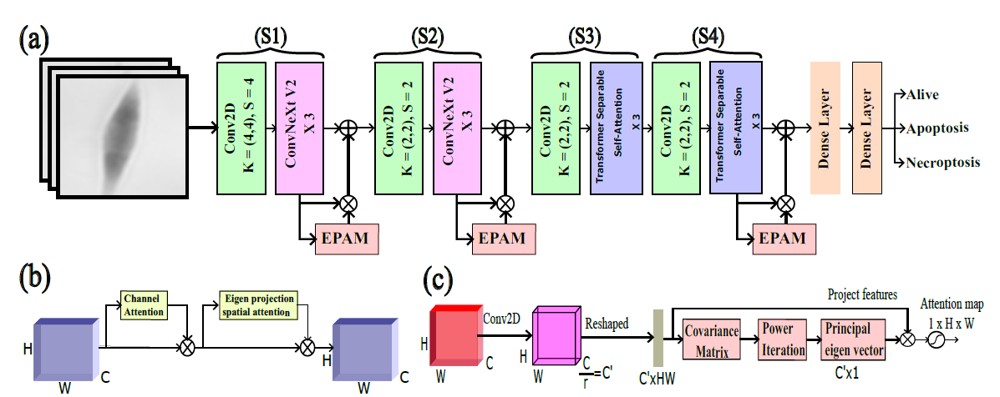

# Dead Assay Classification

Deep learning approach integrating convolutional neural networks (CNNs) and vision transformers for classifying unlabelled L929sAhFas cells into live, apoptosis, and necroptosis obtained using the digital holographic microscopy technique. To further enhance the model’s performance, we integrate an Eigen Projection-based Attention Mechanism (EPAM) block after the ConvNext V2 stages and the final transformer block, which guides the network to focus on relevant spatial regions within the image. The proposed method offers a non-invasive and computationally efficient solution for assessing cell death.

**Network Block Diagram**

**Dataset**

Images: Directory with all the images
Labels: The CSV file with annotations

**Model**

hybrid_EPAM.py: This file contain the code for the hybrid model interagrating ConvNext V2 and vision transformers. It also contain the logic of Eigen Projection based Attention Mechanism (EPAM). Each EPAM block consists of a channel attention module, similar to the squeeze-and-excitation block followed by an eigen projection-based spatial attention module

**Training**

train_hybrid_epam.py: This file contain the dataloader and the training pipeline.

utils_HelperFunction.py: Functions to extract and visualize the attention maps at different stages of the proposed model. 
